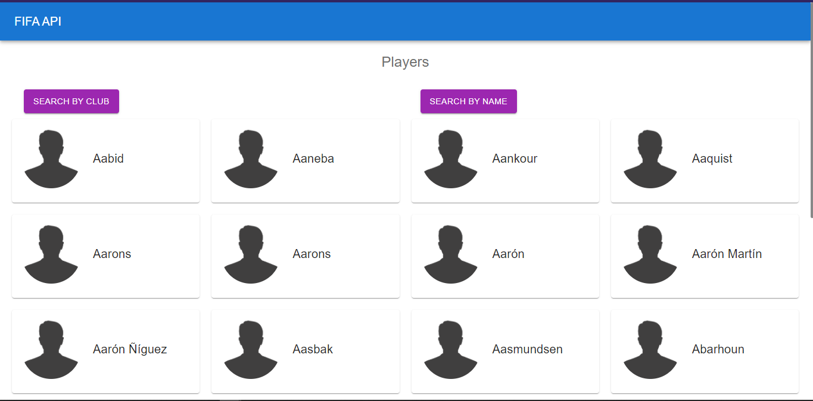

# FIFA API (Client)

## Starting

```
git clone https://github.com/santi280403/FIFA_API_CLIENT.git
```

## Install dependencies

```
yarn install
```

## Set .env.local file

```
NEXT_PUBLIC_TOKEN_AUTHORIZATION=TOKEN_AUTHORIZATION_FROM_SERVER
NEXT_PUBLIC_API=URL_SERVER (http://localhost:4000)
```

## Run server

```
yarn start
```

## The Proyect


